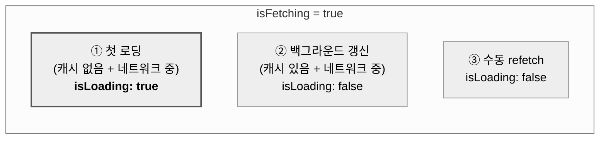
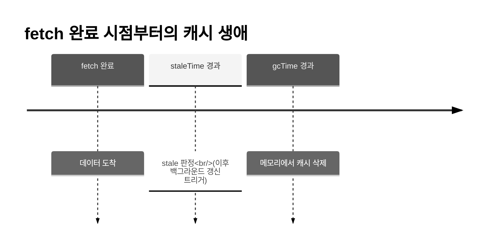
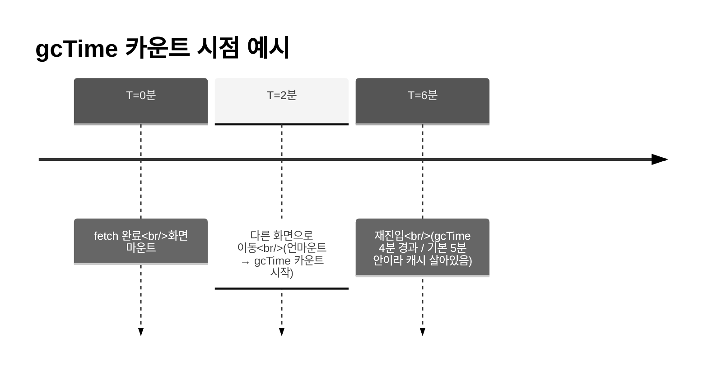

> 이 글은 **React Native를 다루지만 TanStack Query는 이름 정도만 들어본 입문자**를 대상으로 합니다.
> 회사 RN 프로젝트의 파운데이션을 잡는 과정에서 이 패키지를 왜 선택하는지, 어떻게 동작하는지를 한 흐름으로 정리했습니다.
{: .prompt-info }

## 🤔 왜 이 글을 쓰게 됐나

회사 RN 브라운필드 프로젝트의 기초 구조를 잡는 과정에서, 데이터 페칭 레이어로 TanStack Query를 검토하게 됐습니다. 커뮤니티에서 자주 쓰인다는 건 알았지만, **"왜 이걸 굳이 선택하는가", "들어오면 무엇이 바뀌는가"** 를 본인 말로 설명할 수 있는 수준은 아니었습니다.

그래서 이 글은 라이브러리 문법 정리가 아니라, 입문자가 한 번 따라가면 **"왜 필요하고, 어떻게 일하고, RN에서는 무엇이 다른지"** 를 인과 흐름으로 잡을 수 있도록 구성했습니다.

가장 먼저 짚어야 할 건, 우리가 흔히 "상태"라고 부르는 것 중 일부는 사실 성격이 전혀 다른 데이터라는 사실입니다.

## 🧭 서버 상태와 클라이언트 상태는 다르다

앱이 다루는 데이터는 크게 두 종류로 나뉩니다.

| 구분 | 클라이언트 상태 | 서버 상태 |
|---|---|---|
| 예시 | 모달 열림/닫힘, 입력창 텍스트, 다크모드 토글 | 게시글 목록, 유저 프로필, 알림 카운트 |
| 진실의 원천 | **내 앱** | **서버** |
| 동기화 | 필요 없음 | 끊임없이 필요 |
| 비동기성 | 동기 | 비동기 (네트워크 왕복) |
| 공유 | 보통 한 화면 | 여러 화면이 같은 데이터를 참조 |

클라이언트 상태는 `useState` 하나로 충분합니다. 내가 set하면 그게 진실이니까요. 반면 서버 상태는 다릅니다. **내가 화면에 들고 있는 값은 "서버 값의 과거 스냅샷"** 일 뿐입니다. 다른 사용자가 글을 올린 순간 서버는 이미 바뀌었지만 내 화면은 모릅니다.

이 차이를 무시한 채 서버 데이터를 `useState + useEffect`로 직접 다루면 다음과 같은 문제들이 따라옵니다.

1. **중복 요청** — 같은 데이터를 두 컴포넌트가 동시에 요구하면 API를 두 번 칩니다.
2. **캐시 없음** — 목록 → 상세 → 뒤로가기 시 매번 처음부터 받아옵니다.
3. **포커스 갱신 없음** — 앱을 백그라운드에 두고 오랜만에 다시 켜도 옛 데이터를 보여줍니다.
4. **재시도 직접 구현** — 네트워크 끊김 후 자동 재요청을 손으로 짜야 합니다.
5. **상태 4종 세트 반복** — `data/loading/error/refetch`를 화면마다 다시 적게 됩니다.
6. **변경 후 동기화** — 새 글을 쓰면 글 목록 화면이 어떻게 갱신될지 직접 관리해야 합니다.

한 줄로 정리하면, **"서버 상태를 클라이언트 상태처럼 다뤘기 때문에"** 생기는 아픔입니다. TanStack Query는 이 지점을 정조준한 라이브러리입니다.

## 📦 TanStack Query의 정체

공식 문서는 자신을 이렇게 소개합니다.

> "TanStack Query makes **fetching, caching, synchronizing and updating server state** in your applications a breeze."

키워드 네 개에 정체가 다 있습니다. **fetching / caching / synchronizing / updating**.

### 흔한 오해 먼저 정리

입문자가 가장 자주 빠지는 함정을 먼저 깨고 가는 게 좋습니다.

**❌ "Redux 대체재"**

아닙니다. Redux는 클라이언트 상태용, TanStack Query는 서버 상태용입니다. 둘은 같이 쓸 수 있고, 오히려 TQ가 들어오면 Redux에 남길 게 줄어듭니다.

**❌ "HTTP 클라이언트 (axios 대체)"**

아닙니다. fetch/axios를 **감싸서 캐시·동기화·재시도를 얹어주는 레이어** 입니다. 실제 HTTP 요청은 여전히 fetch/axios가 합니다.

**❌ "그냥 캐시 라이브러리"**

캐시는 일부입니다. **언제 낡았는지, 언제 새로 받을지, 언제 버릴지** 를 결정하는 정책 엔진에 가깝습니다.

### 코드 한 줄이 바꿔주는 것

`useState + useEffect`로 작성하던 화면이 이렇게 바뀝니다.

```tsx
function PostList() {
  const { data, isLoading, error } = useQuery({
    queryKey: ['posts'],
    queryFn: () => fetch('/api/posts').then(r => r.json()),
  });
  // ...
}
```

코드만 보면 큰 차이가 없어 보이지만, **공짜로 따라오는 것들** 이 핵심입니다.

- 같은 `queryKey`를 쓰는 컴포넌트는 자동으로 **요청 한 번만** 발생
- 한 번 받아온 데이터는 메모리 캐시에 보관되어 **재진입 시 즉시 표시**
- "낡음(stale)" 판정이 나면 **백그라운드에서 자동 갱신**
- 네트워크 끊김 → 재연결 시 **자동 재시도**

### 사서 비유

도서관 사서를 떠올리면 그림이 단순해집니다.

- 책 원본(서버 데이터)은 출판사(서버)에 있음
- 도서관(TQ 캐시)에 사본을 보관
- 같은 책을 여러 사람이 빌리려 하면, 사서가 한 번만 주문해서 모두에게 공유
- 책이 너무 오래된 판이면 사서가 알아서 새 판을 주문 (`staleTime`)
- 아무도 빌리지 않는 책은 일정 시간 뒤 폐기 (`gcTime`)

사서가 TanStack Query, 출판사가 백엔드입니다.

> TanStack Query를 한 문장으로 요약하면, **"서버 상태가 언제 낡았고, 언제 새로 받고, 누구와 공유하는지를 자동으로 관리해주는 라이브러리"** 입니다. fetch는 직접, 정책은 TQ가 담당합니다.
{: .prompt-info }

## 🔑 3대 핵심 개념: QueryClient · Query Key · useQuery

이제 TQ가 어떻게 일하는지 내부 구조를 들여다봅니다. 입문자가 꼭 알아야 할 세 가지만 짚습니다.

### QueryClient — 캐시 저장소이자 정책 엔진

모든 캐시가 보관되는 중앙 저장소입니다. 앱당 보통 하나만 만듭니다.

```tsx
import { QueryClient, QueryClientProvider } from '@tanstack/react-query';

const queryClient = new QueryClient({
  defaultOptions: {
    queries: {
      staleTime: 1000 * 60,
      retry: 2,
    },
  },
});

export default function App() {
  return (
    <QueryClientProvider client={queryClient}>
      <RootNavigator />
    </QueryClientProvider>
  );
}
```

`QueryClient`는 상태가 아니라 **인스턴스** 입니다. 위치상으로는 Redux store에 가깝습니다. RN에서는 `App.tsx` 최상단에서 한 번 만들고 Provider로 감싸면 끝입니다.

### Query Key — 캐시의 사물함 번호

TanStack Query의 가장 독특한 발명입니다. 모든 캐시 항목에는 **고유한 키** 가 붙습니다.

```tsx
// 게시글 전체 목록
useQuery({ queryKey: ['posts'], queryFn: ... });

// 특정 게시글 (id가 다르면 캐시도 다름)
useQuery({ queryKey: ['posts', postId], queryFn: ... });

// 필터링된 목록
useQuery({ queryKey: ['posts', { category: 'tech', sort: 'latest' }], queryFn: ... });
```

`queryKey`는 배열이며, **배열 내용이 같으면 같은 캐시** 를 가리킵니다. 헬스장 사물함 번호와 같은 역할입니다. 같은 번호로 가면 같은 사물함이 열리고, 번호가 다르면 다른 사물함이 열립니다.

이 단순한 규칙 덕분에 가능한 일들이 있습니다.

- 화면 A에서 `['posts', 5]` 요청 → 캐시에 저장
- 화면 B에서 동일하게 `['posts', 5]` 요청 → **네트워크 안 가고 즉시 캐시 반환**
- 5번 글이 수정되면 `['posts', 5]`만 무효화 → 다른 글 캐시는 그대로 유지

### useQuery — 캐시를 구독하는 훅

`useQuery`는 단순히 데이터를 가져오는 함수가 아니라, **특정 queryKey의 캐시를 구독하는 훅** 입니다.

```tsx
const { data, isLoading, isError, error, refetch, isFetching } = useQuery({
  queryKey: ['posts', postId],
  queryFn: () => fetchPost(postId),
});
```

반환값 중 입문자가 가장 헷갈리는 두 가지가 `isLoading`과 `isFetching`입니다.

| 필드 | 의미 |
|---|---|
| `isLoading` | **보여줄 데이터가 없는 상태에서** 로딩 중일 때만 true |
| `isFetching` | 캐시 유무와 무관하게 **언제든 네트워크 요청 중** 이면 true |

`isLoading`은 `isFetching`의 부분집합입니다.



화면에서는 이렇게 다르게 활용합니다.

| 상황 | 캐시 | isLoading | isFetching | 화면 |
|---|---|---|---|---|
| 첫 진입 | 없음 | ✅ | ✅ | 풀스크린 스피너 |
| 재진입, 백그라운드 갱신 중 | 있음 | ❌ | ✅ | 옛 데이터 + 작은 인디케이터 |
| Pull-to-refresh | 있음 | ❌ | ✅ | 옛 데이터 + 리프레시 컨트롤 |

```tsx
if (isLoading) return <FullScreenSpinner />;
return (
  <View>
    {isFetching && <SmallRefreshIndicator />}
    <PostList data={data} />
  </View>
);
```

> 핵심 한 줄: **isLoading은 "보여줄 데이터가 있느냐 없느냐"라는 신호** 이고, **isFetching은 "지금 네트워크를 다녀오는 중이냐"라는 신호** 입니다. 후자가 더 자주 켜집니다.
{: .prompt-tip }

## ⏱ 신선도 모델: staleTime vs gcTime

TanStack Query에서 입문자가 가장 많이 헷갈리는 부분이지만, 사물함 비유로 가면 단순합니다.

### 캐시에는 두 가지 시간이 있다



- **staleTime**: 데이터를 "신선(fresh)" 하다고 봐줄 시간
- **gcTime** (구버전 `cacheTime`): 아무도 안 보면 메모리에서 비울 시간

### 왜 두 단계로 나뉘었나

처음엔 이상해 보입니다. "오래되면 그냥 지우면 되지 왜 두 단계?" 이게 TQ의 진짜 영리한 부분입니다.

| 상태 | 의미 | 화면 진입 시 동작 |
|---|---|---|
| **fresh** | 신선함 | 네트워크 안 감, 캐시만 반환 |
| **stale** | 낡았지만 보관 중 | **옛 데이터 즉시 표시 + 백그라운드 갱신** |
| **gc** | 메모리에서 삭제됨 | 첫 로딩처럼 동작 |

핵심은 가운데 stale 상태입니다. **"낡았다"가 "버린다"를 의미하지 않습니다.** 옛 데이터로라도 화면을 즉시 채우는 게 사용자 경험에 훨씬 좋기 때문입니다.

### 사물함 비유로 다시

- **staleTime**: 사물함 안 물건이 신선하다고 인정해줄 시간 → 이 시간 안에는 사물함만 열어보고 끝
- **gcTime**: 사물함을 비울지 결정하는 시간 → 아무도 안 열어보는 채로 이 시간이 지나면 청소
- "낡았다(stale)"는 **"새로 받을 때가 됐다"** 일 뿐, **"버린다"가 아님**

### 기본값과 직관

| 옵션 | TQ v5 기본값 | 의미 |
|---|---|---|
| `staleTime` | **0** | 받자마자 stale → 다음 진입마다 백그라운드 갱신 |
| `gcTime` | **5분** | 아무도 안 보는 캐시는 5분 뒤 메모리에서 제거 |

`staleTime: 0`이 놀라울 수 있습니다. "그럼 캐시 의미가 있나?" 싶지만, 의미가 있습니다. **화면 첫 진입에서 옛 데이터를 즉시 표시하고 백그라운드에서 갱신** 하는 패턴이 가능해지기 때문입니다. `isLoading: false`, `isFetching: true`로 켜지는 그 시나리오입니다.

### gcTime은 언제 카운트되나

자주 놓치는 포인트입니다. `gcTime`은 **마지막 구독자가 사라진 시점부터** 카운트됩니다.



화면이 마운트되어 `useQuery`가 살아있으면 `gcTime`은 계속 리셋됩니다. 사물함을 누군가 계속 쓰고 있으면 청소하지 않는 것과 같습니다.

### 실전 설정 감각

```tsx
// 자주 안 바뀌는 데이터
useQuery({ queryKey: ['user', 'me'], queryFn, staleTime: 1000 * 60 * 5 });

// 실시간성 중요
useQuery({ queryKey: ['notifications'], queryFn, staleTime: 0 });

// 거의 변하지 않음
useQuery({ queryKey: ['regions'], queryFn, staleTime: Infinity });
```

**staleTime은 데이터의 변경 빈도** 에 맞추는 게 직관입니다. 자주 안 바뀌면 길게, 자주 바뀌면 짧게.

> 한 줄 정리: **staleTime은 네트워크 정책, gcTime은 메모리 정책** 입니다. 둘은 완전히 다른 일을 합니다.
{: .prompt-info }

## ✏️ 데이터 변경: useMutation과 invalidateQueries

지금까지는 데이터를 받아오는 이야기였습니다(read). 이번엔 데이터를 바꾸는 이야기입니다(create/update/delete).

### useQuery vs useMutation

| | useQuery | useMutation |
|---|---|---|
| 용도 | 데이터 **읽기** | 데이터 **변경** (POST/PUT/DELETE) |
| 실행 시점 | 컴포넌트 마운트 시 자동 | 사용자가 mutate 함수 호출 |
| 캐시 | 자동 캐싱 | 캐시 안 함 (일회성) |

```tsx
function NewPostForm() {
  const mutation = useMutation({
    mutationFn: (newPost) => fetch('/api/posts', {
      method: 'POST',
      body: JSON.stringify(newPost),
    }).then(r => r.json()),
  });

  return (
    <View>
      {mutation.isPending && <Text>저장 중...</Text>}
      {mutation.isError && <Text>실패</Text>}
      <Button onPress={() => mutation.mutate({ title: '...' })} title="저장" />
    </View>
  );
}
```

핵심 차이는 단순합니다. **useQuery는 자동, useMutation은 수동**.

### 진짜 문제는 변경 이후

글을 새로 썼다고 가정해봅니다. POST 요청은 성공했습니다. 끝일까요? 아닙니다. 글 목록 화면(`useQuery(['posts'])`)은 여전히 **옛 캐시** 를 보고 있습니다. 새 글이 화면에 안 보입니다. 앞서 짚은 6번째 아픔, "변경 후 동기화" 문제가 여기서 터집니다.

### invalidateQueries로 해결

```tsx
import { useMutation, useQueryClient } from '@tanstack/react-query';

function NewPostForm() {
  const queryClient = useQueryClient();

  const mutation = useMutation({
    mutationFn: (newPost) => fetch('/api/posts', { method: 'POST', body: ... }),
    onSuccess: () => {
      queryClient.invalidateQueries({ queryKey: ['posts'] });
    },
  });
}
```

`invalidateQueries`가 하는 일은 세 가지입니다.

1. 해당 `queryKey`의 캐시를 **stale로 표시**
2. 현재 마운트된 구독자가 있다면 **자동으로 백그라운드 재요청**
3. 사용자는 옛 목록을 보다가 새 글이 추가된 목록으로 자연스럽게 갱신됨

> 핵심: invalidate는 **"이 캐시 낡은 걸로 표시해, 다음에 누가 보면 새로 받아"** 라는 신호입니다. 강제 삭제가 아닙니다.
{: .prompt-tip }

### Query Key 설계가 빛나는 순간

`queryKey`는 **prefix match** 가 가능합니다. 앞부분이 일치하면 전부 무효화 대상입니다.

```tsx
// 캐시들
['posts']
['posts', 5]
['posts', { category: 'tech' }]
['user', 'me']

// 5번 글만 무효화
queryClient.invalidateQueries({ queryKey: ['posts', 5] });

// 'posts'로 시작하는 모든 것 무효화
queryClient.invalidateQueries({ queryKey: ['posts'] });
```

그래서 키를 계층적으로 설계하면, "글 관련 캐시 전부 갱신"이 한 줄로 끝납니다. 처음 설계할 때는 **넓게 invalidate** 하는 게 안전합니다. 데이터 정합성이 깨지는 것보다 한두 번 더 요청 가는 게 낫고, 실제 성능 이슈가 생기면 그때 좁히면 됩니다.

## 📱 RN에서는 조금 다르게 동작해요

TanStack Query의 자동 갱신 기능 중 일부는 **웹 브라우저 API** 를 가정해 만들어졌습니다. RN에는 그 API가 없거나 다르게 동작하기 때문에, 다음 상황들에서는 **직접 연결 작업이 필요** 합니다.

- **앱이 백그라운드 → 포그라운드** 로 돌아왔을 때 자동 갱신 (`AppState` → `focusManager`)
- **네트워크 재연결** 시 자동 재시도 (`NetInfo` → `onlineManager`)
- **다른 화면 갔다 돌아왔을 때** 갱신 (`useFocusEffect` + `refetch`)

웹에서는 윈도우 포커스/온라인 이벤트가 자동으로 잡히지만, RN에는 그런 게 없습니다. 한 번만 연결해두면 끝나는 셋업이니, 프로젝트 초기에 챙겨두면 됩니다. 자세한 코드는 공식 [React Native 통합 가이드](https://tanstack.com/query/latest/docs/framework/react/react-native)에 정리되어 있습니다.

> RN 입문자가 자주 놓치는 포인트: "focus" 개념이 웹과 RN에서 다릅니다. 웹은 윈도우 포커스, RN은 AppState + 네비게이션 화면 포커스의 **두 축** 입니다.
{: .prompt-info }

## 🔗 레퍼런스

> **해당 자료를 찾아보며 도움이 됐던 링크**
> - [TanStack Query 공식 문서](https://tanstack.com/query/latest)
> - [React Native 통합 가이드](https://tanstack.com/query/latest/docs/framework/react/react-native)
> - [Important Defaults](https://tanstack.com/query/latest/docs/framework/react/guides/important-defaults)
> - [Query Invalidation](https://tanstack.com/query/latest/docs/framework/react/guides/query-invalidation)
