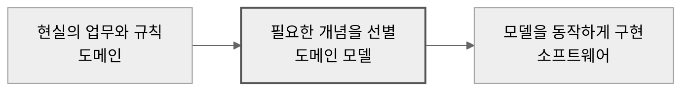
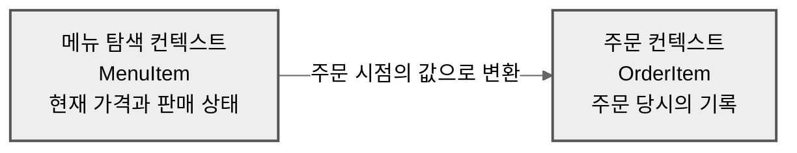
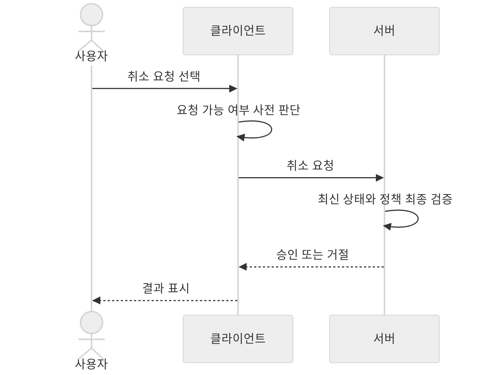

> 이 글은 **DDD를 들어봤지만 실무에 적용해보지 못한 클라이언트 개발자**를 대상으로 합니다. 특정 언어나 프레임워크의 구현법보다, 도메인을 이해하고 설계에 반영하는 기준을 다룹니다.
{: .prompt-info }

## 🤔 DDD를 다시 이해하려는 이유

DDD를 처음 접했을 때는 서버 개발자가 사용하는 거대한 아키텍처처럼 보였다. 엔티티, 값 객체, 애그리게이트처럼 낯선 용어가 먼저 등장했고, 이를 어떤 폴더에 배치해야 하는지가 설명의 중심에 놓이곤 했다.

하지만 클라이언트에도 주문, 결제, 구독처럼 복잡한 업무 규칙이 있다. 서버 응답을 화면에 표시하는 것만으로는 사용자가 어떤 행동을 할 수 있는지 일관되게 설명하기 어렵다. 패턴을 외우기 전에 도메인이 무엇인지부터 짚어야 DDD가 보인다.

## 🌍 도메인은 현실의 문제 영역이다

DDD에서 도메인(Domain)은 소프트웨어가 해결하려는 현실의 문제 영역을 가리킨다. 배달 앱의 도메인은 Swift나 React Native가 아니라 음식 주문과 배달이다. 메뉴, 주문, 결제, 배달은 이 도메인 안에서 사용하는 개념이다.

도메인과 도메인 모델(Domain Model)은 다르다. 도메인이 실제 지역이라면 도메인 모델은 목적에 맞게 그린 지도다. 지도는 현실의 모든 모습을 담지 않고, 길을 찾는 데 필요한 도로와 건물만 남긴다. 도메인 모델도 소프트웨어가 문제를 푸는 데 필요한 개념과 규칙만 선택한다.



에릭 에번스의 [DDD Reference](https://www.domainlanguage.com/ddd/reference/)는 도메인을 지식, 영향 또는 활동의 영역으로 정의한다. 도메인 모델은 그 영역에서 선택한 측면을 추상화해 문제 해결에 쓰는 모델이다.

## 🧠 도메인 지식이 정답을 결정한다

주문 취소 기능을 만든다고 가정해보자. 개발자가 취소를 주문 상태만 바꾸는 일로 이해하면 코드는 간단하다. 그러나 실제 업무에는 결제 취소, 환불, 가게 통보, 조리 시작 여부처럼 여러 규칙이 연결된다.

조리가 시작된 주문은 취소할 수 없고, 가게 사정으로 취소되면 보상이 필요할 수도 있다. 이 규칙을 놓친 코드는 오류 없이 실행돼도 잘못된 소프트웨어다. 주문은 취소됐지만 환불되지 않는다면 기능은 동작해도 현실의 문제는 해결하지 못했다.

개발자가 모든 업무를 처음부터 알아야 한다는 뜻은 아니다. 기획자, 운영 담당자, 서버 개발자와 대화하며 모르는 규칙을 발견하고 모델에 반영해야 한다. 도메인 지식은 무엇을 만들지뿐만 아니라 어떤 동작이 올바른지도 결정한다.

## 🎯 DDD는 도메인이 설계를 이끌게 한다

DDD(Domain-Driven Design)는 복잡한 도메인을 이해하고, 그 이해가 소프트웨어 설계를 이끌게 하는 접근법이다.

API 중심의 클라이언트는 서버 응답의 필드와 상태 코드를 여러 화면에서 직접 해석하기 쉽다. `status == "COOKING"` 같은 조건이 목록, 상세, 알림 화면에 흩어지면 각 화면이 취소 가능 여부를 따로 판단한다.

도메인 중심의 클라이언트는 먼저 제품의 언어로 질문한다. 주문은 언제 취소를 요청할 수 있는가, 취소 요청과 취소 확정은 어떻게 다른가를 모델에 담는다. UI는 서버 상태 문자열보다 `order.canRequestCancellation`처럼 의미가 드러나는 모델을 사용한다.

```swift
struct Order {
    let id: OrderID
    let status: OrderStatus

    var canRequestCancellation: Bool {
        status == .awaitingAcceptance || status == .accepted
    }
}
```

`Domain` 폴더를 만들거나 모든 동작을 유스케이스로 감싼다고 DDD가 되지는 않는다. 모델이 대화 속 업무 개념을 표현하고, 코드가 그 모델을 따라야 한다. Microsoft의 [DDD 마이크로서비스 설계 가이드](https://learn.microsoft.com/en-us/dotnet/architecture/microservices/microservice-ddd-cqrs-patterns/ddd-oriented-microservice)는 패턴 자체보다 코드를 비즈니스 문제에 맞추고 같은 업무 용어를 쓰는 일이 중요하다고 설명한다.

## 🗣️ 공통 언어가 모호함을 줄인다

유비쿼터스 언어(Ubiquitous Language)는 도메인 전문가와 개발자가 대화, 문서, 모델, 코드에서 함께 사용하는 언어다. 단순한 용어집이 아니라 모델을 계속 다듬는 수단이다.

팀에서 `취소`라는 말 하나로 버튼 클릭, 취소 요청, 취소 승인, 환불 완료를 모두 표현하면 모호함이 API와 코드까지 퍼진다. `cancel()`이라는 함수만 보고는 서버에 요청을 보내는지, 주문 상태를 확정하는지 알기 어렵다.

개념을 나누면 코드도 달라진다. `requestCancellation()`, `CancellationStatus.approved`, `RefundStatus.completed`처럼 업무 단계가 이름에 드러난다. 기획, 디자인, 서버, 클라이언트가 같은 문장을 사용하므로 번역 과정에서 생기는 손실도 줄어든다.

## 🧭 모델의 의미가 달라지는 경계를 찾는다

서브도메인(Subdomain)은 큰 사업 도메인을 주문, 결제, 메뉴 탐색처럼 업무 문제별로 나눈 영역이다. 이 가운데 사업의 차별화를 만드는 영역을 핵심 도메인(Core Domain)이라고 한다. 모든 기능에 같은 설계 비용을 쓰지 않고 중요한 문제에 집중하려는 구분이다.

바운디드 컨텍스트(Bounded Context)는 특정 모델과 언어가 일관된 의미를 갖는 경계다. 서브도메인이 현실의 문제를 나눈다면 바운디드 컨텍스트는 소프트웨어 모델이 유효한 범위를 정한다.

메뉴 탐색의 `MenuItem`은 현재 가격과 판매 가능 여부가 중요하다. 주문 내역의 `OrderItem`은 주문 당시의 이름, 가격, 선택 옵션을 보존해야 한다. 현재 메뉴 가격이 10,000원에서 12,000원으로 바뀌어도 과거 주문 금액은 바뀌면 안 된다. 둘을 공용 `Product` 타입 하나로 합치면 현재 상태와 거래 당시 기록이 충돌한다.



기능 모듈과 바운디드 컨텍스트가 항상 일치하는 것은 아니다. 폴더를 나눠도 하나의 공용 모델을 모든 기능이 서로 다른 뜻으로 사용한다면 의미의 경계는 여전히 흐리다.

## 🧱 도메인 모델을 코드로 표현한다

엔티티(Entity)는 속성이 바뀌어도 식별자로 계속 추적하는 객체다. 주문 상태가 접수에서 조리 중으로 바뀌어도 같은 `OrderID`를 가진 주문은 동일한 주문이다.

값 객체(Value Object)는 식별자가 아니라 값을 구성하는 속성으로 판단한다. `10,000 KRW` 두 개는 같은 값이지만 `10,000 KRW`와 `10,000 USD`는 다르다. 금액과 통화를 `Money`로 묶으면 통화가 같은 금액끼리만 더한다는 규칙도 함께 둘 수 있다.

애그리게이트(Aggregate)는 여러 객체를 하나의 일관성 단위로 묶은 경계를 가리킨다. 애그리게이트 루트(Aggregate Root)는 외부에서 이 묶음을 변경하는 유일한 진입점이다. 장바구니가 루트라면 외부 코드가 항목 배열을 직접 바꾸지 않고 `cart.add(menu)`를 호출한다. 장바구니는 한 가게의 메뉴만 담는다는 규칙을 스스로 지킨다.

도메인 서비스(Domain Service)는 특정 엔티티나 값 객체 하나에 두기 어려운 업무 규칙을 표현한다. 유스케이스(Use Case)는 조회, 검증, 요청처럼 사용자 행동에 필요한 흐름을 조정한다. 리포지토리(Repository)는 도메인 객체를 API, 캐시, 로컬 저장소 중 어디서 가져오고 저장하는지 감춘다.

이 구성 요소는 전부 사용해야 하는 체크리스트가 아니다. 규칙이 단순한데 타입과 계층만 늘리면 업무 복잡성 대신 구조 복잡성이 커진다.

## 📱 클라이언트와 서버의 책임을 나눈다

클라이언트가 도메인 규칙을 표현하더라도 최종 판정자가 되는 것은 아니다. 클라이언트는 현재 상태를 보고 취소 요청 버튼을 보여주고, 불가능한 입력을 미리 막아 빠른 피드백을 준다. 서버는 최신 주문 상태와 정책을 확인해 취소와 환불을 최종 승인한다.



결제, 환불, 재고, 권한처럼 신뢰성이 중요한 규칙은 서버가 다시 검증해야 한다. 클라이언트 규칙은 사용자 경험을 위한 모델이며 서버 정책을 임의로 새로 만드는 수단이 아니다.

## 🚀 작은 범위부터 DDD를 적용한다

서버 데이터를 그대로 보여주는 공지사항 화면이라면 DTO나 간단한 화면 모델로 충분할 수 있다. 상태 전환이 많고 같은 정책이 여러 화면에 반복되며 용어까지 충돌한다면 도메인 모델의 가치가 커진다. 상태 개수보다 각 상태가 가진 업무 의미와 전환 규칙의 복잡성을 봐야 한다.

실무에서는 폴더 구조보다 언어부터 정리하는 편이 낫다. 취소처럼 모호한 말을 업무 단계별로 나누고, DTO와 앱 모델 사이에 변환 경계를 만든다. 여러 화면에 흩어진 규칙 하나를 모델이나 정책으로 옮겨 테스트한다. 사용자 흐름이 복잡해질 때 유스케이스를 추가하고, 모델의 의미가 충돌할 때 바운디드 컨텍스트를 분리한다.

DDD를 적용할지 고민된다면 세 가지를 확인하면 된다. 팀이 같은 단어를 다른 뜻으로 쓰는가, 업무 규칙이 여러 화면에 흩어졌는가, 정책 변경 때 수정할 곳을 예측하기 어려운가. 세 질문에 계속 그렇다고 답하게 된다면 도메인을 다시 모델링할 시점이다.

## 🔗 레퍼런스

- [Domain-Driven Design Reference, Eric Evans](https://www.domainlanguage.com/ddd/reference/)
- [DDD Resources, Domain Language](https://www.domainlanguage.com/ddd/)
- [Design a DDD-oriented microservice, Microsoft Learn](https://learn.microsoft.com/en-us/dotnet/architecture/microservices/microservice-ddd-cqrs-patterns/ddd-oriented-microservice)
- [Domain layer, Android Developers](https://developer.android.com/topic/architecture/domain-layer)
